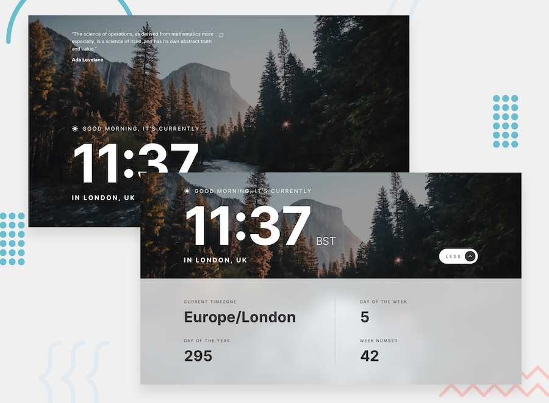

# Clock app

## Overview

This clock application was built as a solution to the Frontend Mentor challenge. The challenge aimed to create a clock application with specific functionalities while closely matching the provided design. The application utilizes various APIs to retrieve data, including the World Time API, IP Geolocation API, and Programming Quotes API.

## Features

- Responsive layout for different screen sizes
- Interactive hover states for elements
- Displays current time and location information based on visitor's IP address
- Shows additional date and time details in expanded state
- Adjusts greeting and background image based on time of day
- Allows users to generate random programming quotes by clicking refresh icon

## Expected Behavior

- Greeting changes dynamically based on time of day:
  - "Good morning" between 5am and 12pm
  - "Good afternoon" between 12pm and 6pm
  - "Good evening" between 6pm and 5am
- Greeting icon and background image change based on time of day:
  - Sun icon and daytime background image between 5am and 6pm
  - Moon icon and nighttime background image between 6pm and 5am
- Clicking the refresh icon generates a new random programming quote

## Technologies Used

- HTML
- CSS
- JavaScript

## Links

- Solution URL: [Clock App Solution](https://matbac85.github.io/clock-app/)
- Frontend Mentor Profile: [Frontend Mentor Profile](https://www.frontendmentor.io/profile/matbac85)
